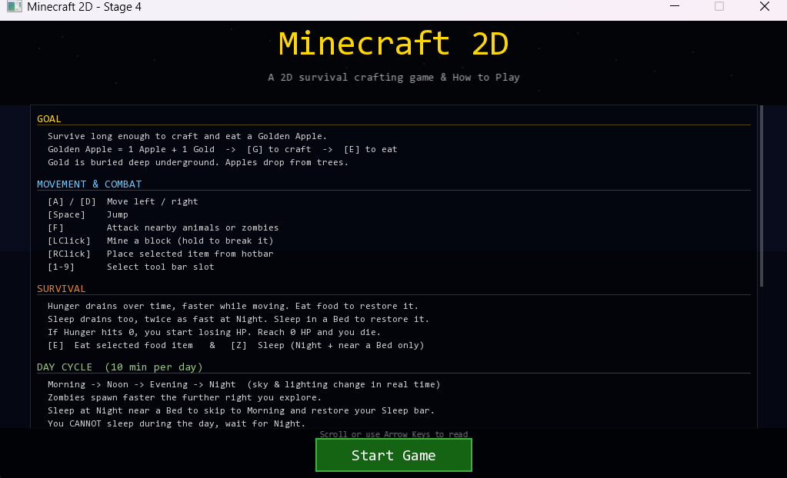
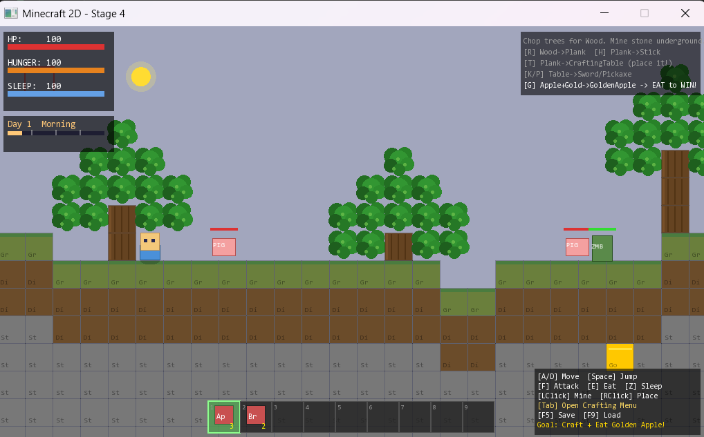
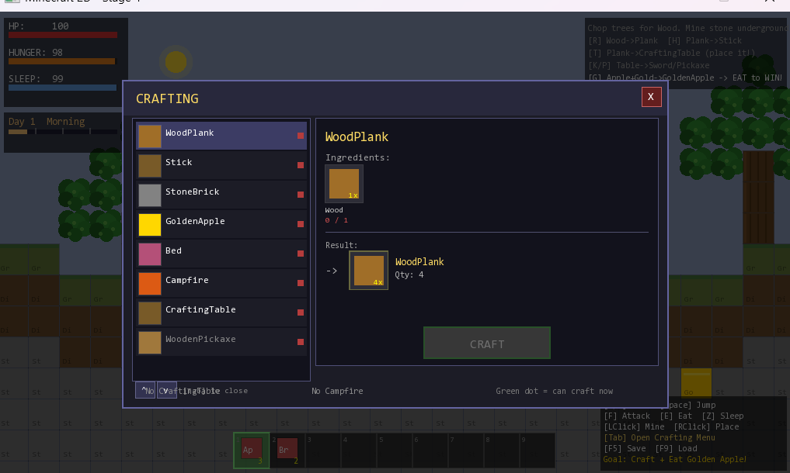

# 2D Minecraft

A 2D Minecraft-style survival game built in C++ with [SFML](https://www.sfml-dev.org/).
Explore, mine blocks, gather resources, hunt animals, fight zombies, craft items, and eat a Golden Apple to win.

## Screenshots

| Title | Gameplay | Crafting |
|---|---|---|
|  |  |  |

## Objective

Survive long enough to craft and eat a **Golden Apple**.

- Recipe: **1 Apple + 1 Gold**
- Apples drop from trees/leaves, gold is mined from the world
- Eat the Golden Apple (`E`) to win

## Features

- Mining and placing blocks
- Hunting animals and fighting zombies
- Crafting system with a Crafting Table, Campfire, and Bed
- Health, Hunger, and Sleep survival stats
- Day/night cycle
- Save and load system

## Controls

| Key / Button                | Action                                  |
|------------------------------|------------------------------------------|
| A / D                        | Move left / right                        |
| Space                        | Jump                                     |
| Left Click (hold)            | Mine block                               |
| Right Click                  | Place selected block or item             |
| 1 – 9                        | Select hotbar slot                       |
| E                            | Eat selected food                        |
| F                            | Attack nearby enemy or animal            |
| Z                            | Sleep when near a Bed at night           |
| Tab                          | Open / close crafting menu               |
| Mouse Click (Crafting UI)    | Select recipe / press **CRAFT**          |
| Mouse Wheel                  | Scroll crafting recipes                  |
| F5 / F9                      | Save / Load                              |
| Escape                       | Close menu or quit                       |

## Project Structure

```
2DMinecraft/
├── include/          # Header files
├── src/              # Implementation files (main.cpp is the entry point)
├── screenshots/       # Screenshots used in this README
├── Project1.vcxproj  # Visual Studio project
└── Makefile          # Alternative build for Linux/macOS (requires SFML on the include/lib path)
```

## Building

### Visual Studio (Windows)

Open `Project1.vcxproj` in Visual Studio 2022 and build. Requires [SFML 2.6.2](https://www.sfml-dev.org/download/sfml/2.6.2/) —
update the include/library paths in the project settings if your SFML install location differs.

### Makefile (Linux/macOS)

```
make
```

Requires SFML to be installed and discoverable by the compiler; adjust `CXXFLAGS`/`LDFLAGS` in the `Makefile` to match your install path.
